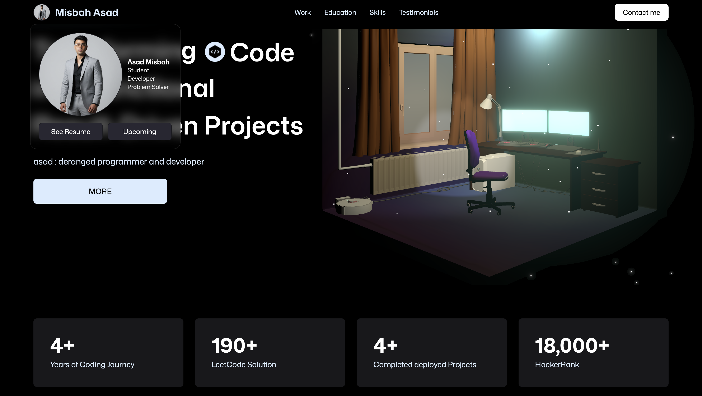
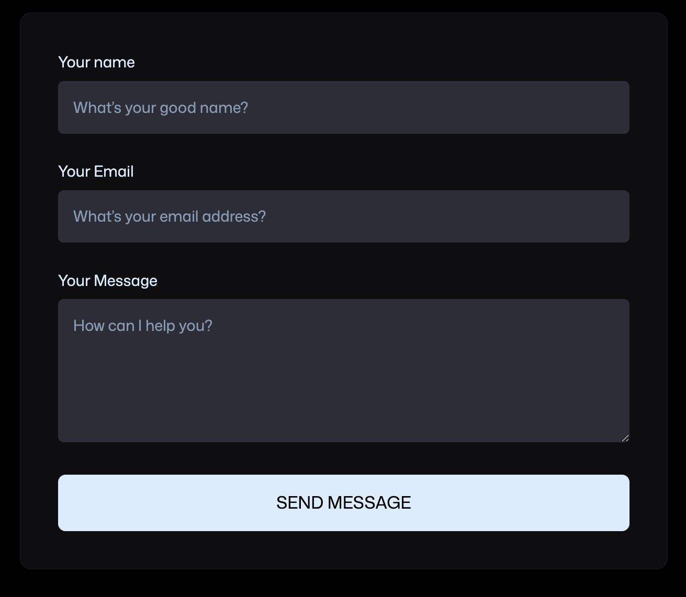
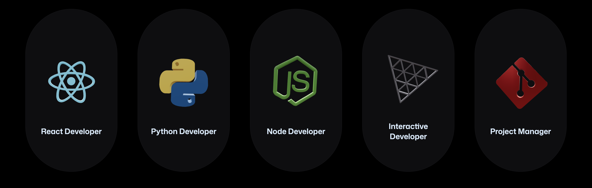

# 3D Interactive Portfolio

> A modern, immersive React portfolio website featuring stunning 3D graphics, smooth animations, and cutting-edge web technologies.

[](https://reactjs.org/)
[](https://threejs.org/)
[](https://vitejs.dev/)
[](https://tailwindcss.com/)
[](https://your-portfolio-url.com)
[](https://opensource.org/licenses/MIT)

## Live Demo

**[View Live Portfolio →](https://portfolio-asad-phi.vercel.app)**

*Experience the future of web portfolios with interactive 3D elements and immersive animations.*

## Table of Contents
- [Live Demo](#live-demo)
- [Screenshots & Preview](#screenshots--preview)
- [Key Features](#key-features)
- [Tech Stack](#tech-stack)
- [Installation & Setup](#installation--setup)
- [Development Commands](#development-commands)
- [Project Structure](#project-structure)
- [Usage & Customization](#usage--customization)
- [Performance Metrics](#performance-metrics)
- [Deployment](#deployment)
- [Contributing](#contributing)
- [License](#license)
- [Contact & Support](#contact--support)
- [Acknowledgments](#acknowledgments)

---

## Performance Metrics

- **Lighthouse Score:** 95+ (Performance, Accessibility, Best Practices, SEO)
- **Bundle Size:** Optimized with Vite's tree-shaking and code splitting
- **Load Time:** < 2 seconds on 3G networks
- **3D Performance:** 60fps animations on modern devices
- **Cross-browser Compatibility:** Chrome, Firefox, Safari, Edge

---

## Deployment

### **Vercel (Recommended)**
1. Connect your GitHub repository to Vercel
2. Set environment variables in Vercel dashboard:
   - `VITE_APP_EMAILJS_SERVICE_ID`
   - `VITE_APP_EMAILJS_TEMPLATE_ID`  
   - `VITE_APP_EMAILJS_PUBLIC_KEY`
3. Deploy automatically on every push

### **Netlify**
1. Build the project: `npm run build`
2. Deploy the `dist` folder to Netlify
3. Configure environment variables in Netlify dashboard
4. Set up continuous deployment from GitHub

### **GitHub Pages**
1. Update `vite.config.js` with your repository name:
   ```javascript
   export default defineConfig({
     base: '/your-repository-name/',
     // ... other config
   })
   ```
2. Use GitHub Actions for automatic deployment
3. Enable GitHub Pages in repository settings

### **Custom Server**
1. Build the project: `npm run build`
2. Upload the `dist` folder to your server
3. Configure your web server to serve the static files
4. Set up SSL certificate for HTTPS

---

## Screenshots & Preview


*Interactive 3D hero section with floating tech logos*


*Interactive 3D models and animations*


*Professional contact form with real-time validation*


*3D tech stack visualization with smooth animations*

---

## Key Features

### **Interactive 3D Experience**
- Dynamic 3D hero section with floating tech logos
- Interactive 3D models and animations using Three.js
- Immersive user experience with @react-three/fiber integration

### **Modern Design & UX**
- Fully responsive design optimized for all devices
- Smooth micro-interactions and page transitions
- Clean, professional UI with Tailwind CSS
- Dark/light theme support (optional)

### **Professional Showcase**
- Detailed experience timeline with interactive elements
- Client testimonials carousel with smooth animations
- Tech stack visualization with 3D representations
- Live statistics and animated counters

### **Communication & Contact**
- Integrated contact form with EmailJS
- Real-time form validation
- Professional email templates
- Social media integration

### **Performance & Development**
- Lightning-fast development with Vite
- Optimized build process and asset management
- Modern React 19 features and best practices
- SEO-friendly structure and meta tags

---

## Tech Stack

### **Frontend Framework**
- **React 19** - Latest React with concurrent features
- **Vite** - Next-generation frontend tooling
- **JavaScript/JSX** - Modern ES6+ syntax

### **3D Graphics & Animation**
- **Three.js** - 3D graphics library
- **@react-three/fiber** - React renderer for Three.js
- **@react-three/drei** - Useful helpers for react-three-fiber
- **GSAP** - Professional-grade animation library
- **@gsap/react** - GSAP React integration

### **Styling & UI**
- **Tailwind CSS** - Utility-first CSS framework
- **Custom CSS** - Additional styling and 3D effects
- **Responsive Design** - Mobile-first approach

### **Communication**
- **EmailJS** - Client-side email service
- **Form Validation** - Real-time input validation

### **Development Tools**
- **ESLint** - Code linting and formatting
- **Vite DevServer** - Hot module replacement
- **Git** - Version control

---

## Installation & Setup

### **Prerequisites**
- Node.js (v18.0.0 or higher)
- npm or yarn package manager
- Git for version control

### **Quick Start**

1. **Clone the repository**
   ```bash
   git clone https://github.com/yourusername/3d-portfolio.git
   cd 3d-portfolio
   ```

2. **Install dependencies**
   ```bash
   npm install
   # or
   yarn install
   ```

3. **Install additional 3D and animation packages**
   ```bash
   npm install gsap @gsap/react three @react-three/fiber @react-three/drei @react-three/postprocessing
   ```

4. **Install and configure Tailwind CSS**
   ```bash
   npm install tailwindcss @tailwindcss/vite
   npx tailwindcss init -p
   ```

5. **Set up environment variables**
   Create a `.env` file in the root directory and add your EmailJS configuration.
   Get these keys by creating an account at [EmailJS](https://www.emailjs.com/):
   
   ```env
   VITE_APP_EMAILJS_SERVICE_ID=your_service_id_here
   VITE_APP_EMAILJS_TEMPLATE_ID=your_template_id_here
   VITE_APP_EMAILJS_PUBLIC_KEY=your_public_key_here
   ```
   
   **How to get EmailJS keys:**
   - Visit [emailjs.com](https://www.emailjs.com/) and create an account
   - Create an email service (Gmail, Outlook, etc.)
   - Create an email template for your contact form
   - Copy the Service ID, Template ID, and Public Key to your `.env` file

6. **Start the development server**
   ```bash
   npm run dev
   # or
   yarn dev
   ```

7. **Open your browser**
   Navigate to `http://localhost:5173` to view the portfolio.

---

## Development Commands

| Command | Description |
|---------|-------------|
| `npm run dev` | Start development server with hot reload |
| `npm run build` | Build for production |
| `npm run preview` | Preview production build locally |
| `npm run lint` | Run ESLint for code quality |
| `npm run lint:fix` | Auto-fix ESLint issues |

---

## Project Structure

```
3d-portfolio/
├── public/
│   ├── models/             # 3D models and assets
│   ├── images/             # Static images
│   └── favicon.ico         # Site favicon
├── src/
│   ├── components/         # Reusable UI components
│   │   ├── Hero/           # Hero section with 3D elements
│   │   ├── Experience/     # Experience timeline
│   │   ├── Showcase/       # Project showcase
│   │   ├── TechStack/      # Technology visualization
│   │   ├── Testimonials/   # Client testimonials
│   │   ├── Contact/        # Contact form
│   │   └── Footer/         # Site footer
│   ├── constants/          # Static data and configuration
│   ├── utils/              # Helper functions
│   ├── styles/             # Global styles and Tailwind config
│   ├── App.jsx             # Main application component
│   └── main.jsx            # Application entry point
├── package.json            # Dependencies and scripts
├── vite.config.js          # Vite configuration
├── tailwind.config.js      # Tailwind CSS configuration
├── eslint.config.js        # ESLint configuration
└── README.md               # Project documentation
```

---

## Usage & Customization

### **Personalizing Your Portfolio**

1. **Update Personal Information**
   - Edit `src/constants/index.js` with your details
   - Replace placeholder content with your experience
   - Add your projects and testimonials

2. **Customize 3D Models**
   - Add your 3D models to `public/models/`
   - Update model references in components
   - Adjust lighting and camera positions

3. **Modify Styling**
   - Customize colors in `tailwind.config.js`
   - Add custom CSS in `src/styles/`
   - Adjust animations and transitions

4. **Configure EmailJS**
   - Set up EmailJS account and templates
   - Update environment variables
   - Test contact form functionality

### **Creating a .env.example File**
Create a `.env.example` file in your project root for reference:
```env
# EmailJS Configuration
VITE_APP_EMAILJS_SERVICE_ID=your_service_id_here
VITE_APP_EMAILJS_TEMPLATE_ID=your_template_id_here
VITE_APP_EMAILJS_PUBLIC_KEY=your_public_key_here
```

**Note:** Remember to add `.env` to your `.gitignore` file to keep your credentials secure.

---

## Contributing

We welcome contributions to make this portfolio template even better!

### **How to Contribute**

1. **Fork the repository**
2. **Create a feature branch**
   ```bash
   git checkout -b feature/amazing-feature
   ```
3. **Make your changes**
4. **Commit your changes**
   ```bash
   git commit -m 'Add some amazing feature'
   ```
5. **Push to the branch**
   ```bash
   git push origin feature/amazing-feature
   ```
6. **Open a Pull Request**

### **Contribution Guidelines**
- Follow existing code style and conventions
- Write clear, descriptive commit messages
- Test your changes thoroughly
- Update documentation as needed
- Ensure responsive design compatibility

---

## License

This project is licensed under the **MIT License** - see the [LICENSE](LICENSE) file for details.

```
MIT License - feel free to use this project for personal and commercial purposes.
```

---

## Contact & Support

**Developer:** Mohammad Asad Misbah 
**Email:** misbah6634@gmail.com  
**Portfolio:** [Portfolio](https://portfolio-asad-phi.vercel.app)  
**LinkedIn:** [misbahasad](https://www.linkedin.com/in/misbahasad/)  
**GitHub:** [mixbah](https://github.com/mixbah)

### **Get in Touch**
- Available for freelance projects
- Open to collaboration opportunities
- Interested in full-time positions
- Always excited to discuss new technologies

---

## Acknowledgments

Special thanks to the amazing open-source community and the creators of:

- **[Three.js](https://threejs.org/)** - For making 3D graphics accessible on the web
- **[React Three Fiber](https://docs.pmnd.rs/react-three-fiber)** - For bridging React and Three.js
- **[GSAP](https://greensock.com/gsap/)** - For professional animation capabilities
- **[Tailwind CSS](https://tailwindcss.com/)** - For utility-first CSS framework
- **[Vite](https://vitejs.dev/)** - For lightning-fast development experience
- **[EmailJS](https://www.emailjs.com/)** - For client-side email functionality

---

## Project Stats

- **React 19** - Latest React features
- **3D Graphics** - Interactive Three.js elements
- **Responsive** - Works on all devices
- **Fast** - Optimized performance with Vite
- **Professional** - Production-ready code

---

**Made with care and attention to detail**

*If you found this portfolio helpful, please consider giving it a star on GitHub!*